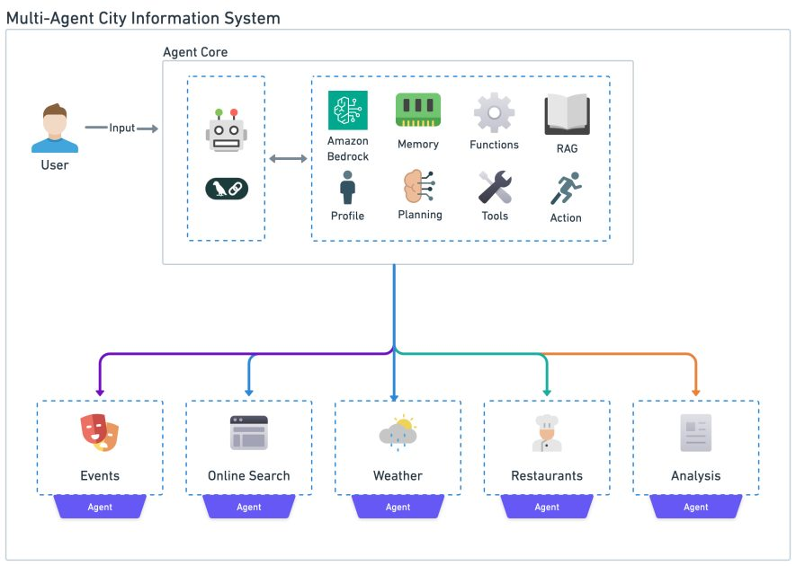
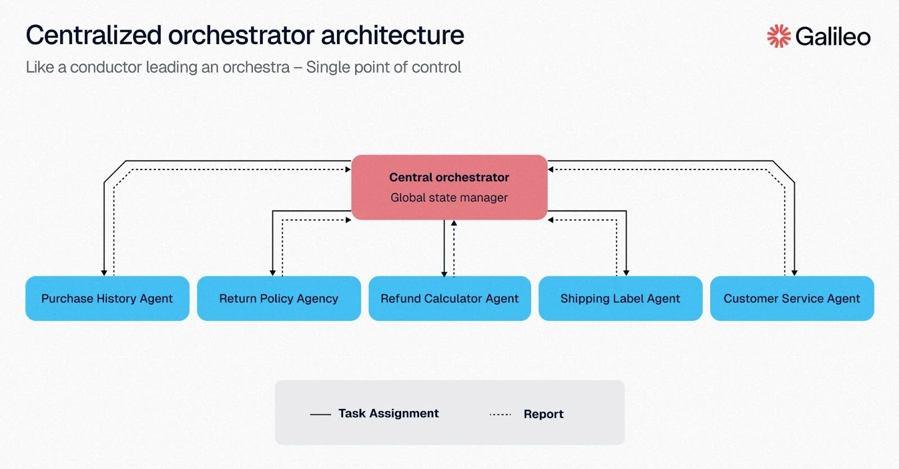
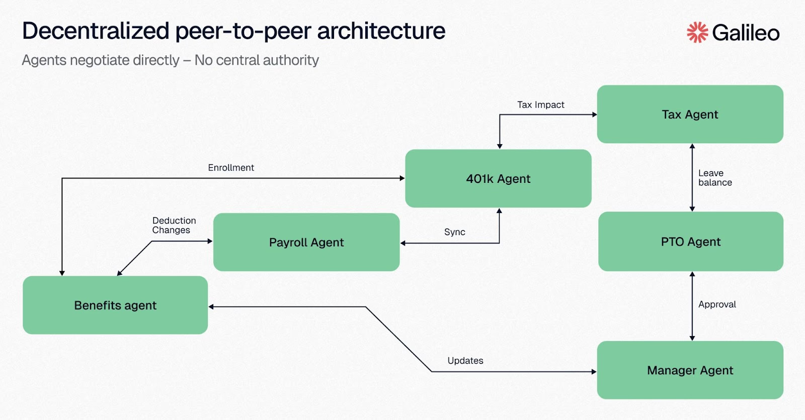
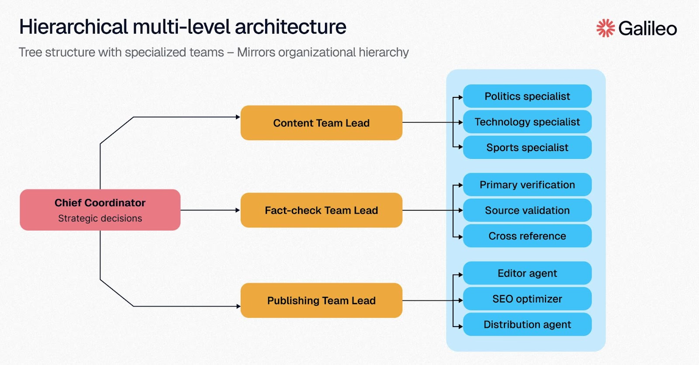
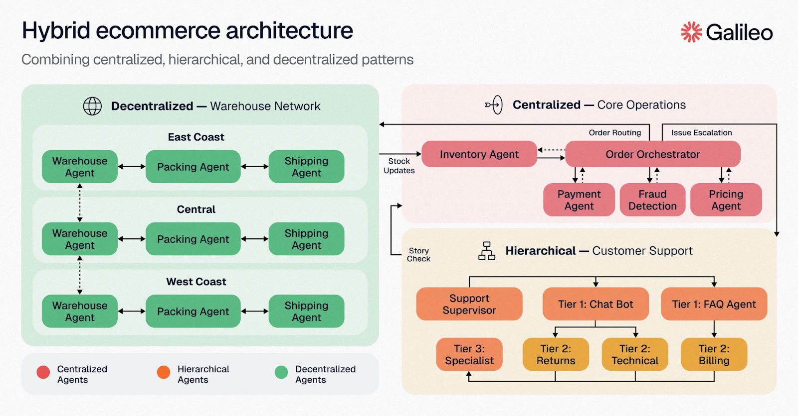
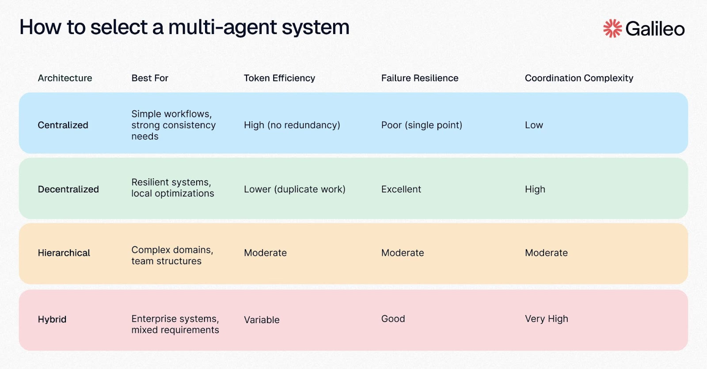
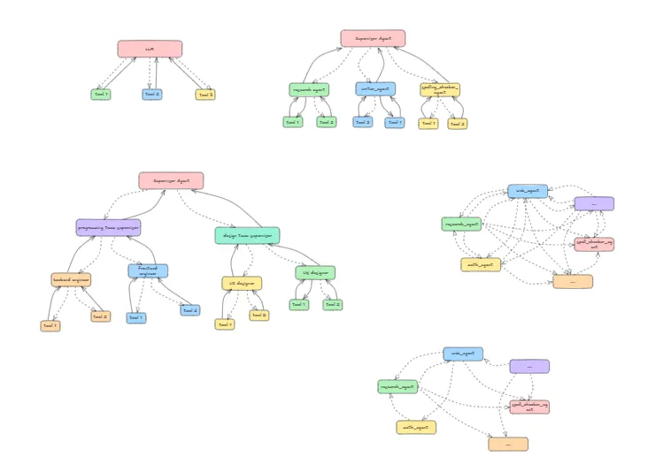

# Architectures for Multi-Agent Systems

## **What is MultiAgent architecture?**


Multi-agent architecture is a structured approach where multiple independent agents work together to handle complex tasks. Each agent has a specific role, communicates with others, and contributes to a shared goal. This system enables distributed problem-solving, specialization, and scalability.These individual agents don’t work in isolation, they interact, exchange insights, and adapt in real time.
- 🧠 Context management: Provide specialized knowledge without overwhelming the model’s context window. If context were infinite and latency zero, you could dump all knowledge into a single prompt — but since it’s not, you need patterns to selectively surface relevant information.
- Distributed development: Allow different teams to develop and maintain capabilities independently, composing them into a larger system with clear boundaries.
- Parallelization: Spawn specialized workers for subtasks and execute them concurrently for faster results.

💡 At the center of multi-agent design is context engineering — deciding what information each agent sees. The quality of your system depends on ensuring each agent has access to the right data for its task.

**Why Architecture Shapes Everything**
- Information flow: In centralized systems, all data flows through one hub, creating a bottleneck but ensuring consistency. Decentralized systems allow direct peer communication, enabling faster local decisions but risking global inconsistency.

- Failure modes: A centralized orchestrator creates a single point of failure. Take it down, and the entire system stops. Decentralized architectures continue operating even when multiple agents fail, but coordination becomes exponentially harder.

- Scaling patterns: Single-agent architectures scale poorly with increasing tool count and context size. Performance decreases significantly even when the context is irrelevant to the target task. Multi-agent architectures solve this by distributing context across agents with separate windows

## Patterns
1. Centralized: The Orchestrator Pattern

    A single powerful agent acts as the brain, coordinating all other agents. This central agent allocates tasks, monitors progress, and synthesizes results. The orchestrator maintains global state and makes all routing decisions. Every action traces back to central decision-making, creating predictable, debuggable behavior. You always know why something happened and which agent made the call. This scales well by leveraging the map-reduce pattern.
    
    Here is a reference implementation from Langgraph.
    ```bash
    from typing import Literal
    from langchain_openai import ChatOpenAI
    from langgraph.types import Command
    from langgraph.graph import StateGraph, MessagesState, START, END

    model = ChatOpenAI()

    def supervisor(state: MessagesState) -> Command[Literal["agent_1", "agent_2", END]]:
        # you can pass relevant parts of the state to the LLM (e.g., state["messages"])
        # to determine which agent to call next. a common pattern is to call the model
        # with a structured output (e.g. force it to return an output with a "next_agent" field)
        response = model.invoke(...)
        # route to one of the agents or exit based on the supervisor's decision
        # if the supervisor returns "__end__", the graph will finish execution
        return Command(goto=response["next_agent"])

    def agent_1(state: MessagesState) -> Command[Literal["supervisor"]]:
        # you can pass relevant parts of the state to the LLM (e.g., state["messages"])
        # and add any additional logic (different models, custom prompts, structured output, etc.)
        response = model.invoke(...)
        return Command(
            goto="supervisor",
            update={"messages": [response]},
        )

    def agent_2(state: MessagesState) -> Command[Literal["supervisor"]]:
        response = model.invoke(...)
        return Command(
            goto="supervisor",
            update={"messages": [response]},
        )

    builder = StateGraph(MessagesState)
    builder.add_node(supervisor)
    builder.add_node(agent_1)
    builder.add_node(agent_2)

    builder.add_edge(START, "supervisor")

    supervisor = builder.compile()
    ```

2. Decentralized: Peer-to-Peer Coordination
    
    Here is a reference implementation from Langgraph.
    ```bash
    from typing import Literal
    from langchain_openai import ChatOpenAI
    from langgraph.types import Command
    from langgraph.graph import StateGraph, MessagesState, START, END

    model = ChatOpenAI()

    def agent_1(state: MessagesState) -> Command[Literal["agent_2", "agent_3", END]]:
        # you can pass relevant parts of the state to the LLM (e.g., state["messages"])
        # to determine which agent to call next. a common pattern is to call the model
        # with a structured output (e.g. force it to return an output with a "next_agent" field)
        response = model.invoke(...)
        # route to one of the agents or exit based on the LLM's decision
        # if the LLM returns "__end__", the graph will finish execution
        return Command(
            goto=response["next_agent"],
            update={"messages": [response["content"]]},
        )

    def agent_2(state: MessagesState) -> Command[Literal["agent_1", "agent_3", END]]:
        response = model.invoke(...)
        return Command(
            goto=response["next_agent"],
            update={"messages": [response["content"]]},
        )

    def agent_3(state: MessagesState) -> Command[Literal["agent_1", "agent_2", END]]:
        ...
        return Command(
            goto=response["next_agent"],
            update={"messages": [response["content"]]},
        )

    builder = StateGraph(MessagesState)
    builder.add_node(agent_1)
    builder.add_node(agent_2)
    builder.add_node(agent_3)

    builder.add_edge(START, "agent_1")
    network = builder.compile()
    ```


3. Hierarchical: Multi-Level Management
    
    Here is a reference implementation from Langgraph.
    ```bash
    from typing import Literal
    from langchain_openai import ChatOpenAI
    from langgraph.graph import StateGraph, MessagesState, START, END
    from langgraph.types import Command
    model = ChatOpenAI()

    # define team 1 (same as the single supervisor example above)

    def team_1_supervisor(state: MessagesState) -> Command[Literal["team_1_agent_1", "team_1_agent_2", END]]:
        response = model.invoke(...)
        return Command(goto=response["next_agent"])

    def team_1_agent_1(state: MessagesState) -> Command[Literal["team_1_supervisor"]]:
        response = model.invoke(...)
        return Command(goto="team_1_supervisor", update={"messages": [response]})

    def team_1_agent_2(state: MessagesState) -> Command[Literal["team_1_supervisor"]]:
        response = model.invoke(...)
        return Command(goto="team_1_supervisor", update={"messages": [response]})

    team_1_builder = StateGraph(Team1State)
    team_1_builder.add_node(team_1_supervisor)
    team_1_builder.add_node(team_1_agent_1)
    team_1_builder.add_node(team_1_agent_2)
    team_1_builder.add_edge(START, "team_1_supervisor")
    team_1_graph = team_1_builder.compile()

    # define team 2 (same as the single supervisor example above)
    class Team2State(MessagesState):
        next: Literal["team_2_agent_1", "team_2_agent_2", "__end__"]

    def team_2_supervisor(state: Team2State):
        ...

    def team_2_agent_1(state: Team2State):
        ...

    def team_2_agent_2(state: Team2State):
        ...

    team_2_builder = StateGraph(Team2State)
    ...
    team_2_graph = team_2_builder.compile()


    # define top-level supervisor

    builder = StateGraph(MessagesState)
    def top_level_supervisor(state: MessagesState) -> Command[Literal["team_1_graph", "team_2_graph", END]]:
        # you can pass relevant parts of the state to the LLM (e.g., state["messages"])
        # to determine which team to call next. a common pattern is to call the model
        # with a structured output (e.g. force it to return an output with a "next_team" field)
        response = model.invoke(...)
        # route to one of the teams or exit based on the supervisor's decision
        # if the supervisor returns "__end__", the graph will finish execution
        return Command(goto=response["next_team"])

    builder = StateGraph(MessagesState)
    builder.add_node(top_level_supervisor)
    builder.add_node("team_1_graph", team_1_graph)
    builder.add_node("team_2_graph", team_2_graph)
    builder.add_edge(START, "top_level_supervisor")
    builder.add_edge("team_1_graph", "top_level_supervisor")
    builder.add_edge("team_2_graph", "top_level_supervisor")
    graph = builder.compile()
    ```
4. Hybrid: Strategic Center, Tactical Edges
    


### Making the Architecture Decision



## The Four Primary Agentic Architectures



## Single-agent architectures
A single-agent architecture features a single autonomous entity making centralized decisions within an environment.

**Structure**

A single-agent architecture is a system where a single AI agent operates independently to perceive its environment, make decisions and take actions to achieve a goal.

**Key features**

- Autonomy: The agent operates independently without requiring interaction with other agents.
 
**Strengths**

- Simplicity: Easier to design, develop and deploy compared to multi-agent systems. Requires fewer resources because it does not need to manage multiple agents or communication protocols.
- Predictability: Easier to debug and monitor because the agent operates independently.
- Speed: No need for negotiation or consensus-building among multiple agents.
- Cost: Less expensive to maintain and update compared to complex multi-agent architectures. Fewer integration challenges when deployed in enterprise applications.
 
**Weaknesses**

- Limited scalability: A single agent can become a bottleneck when handling high-volume or complex tasks.
- Rigidity: Struggles with tasks that require multistep workflows or coordination across different domains.
- Narrow: Typically designed for a specific function or domain.
 
**Best use cases**

- Simple chatbots: Chatbots can operate independently, don’t require coordination with other agents and perform well in self-contained, structured user interactions.
- Recommendation systems: Personalized content recommendations such as the ones experienced at streaming services are straightforward enough for a single agent architecture.


## Multi-agent architectures

### Vertical AI architectures

**Structure**

In a vertical architecture, a leader agent oversees subtasks and decisions, with agents reporting back for centralized control. Hierarchical AI agents know their role and report to or oversee other agents accordingly.
 
**Key features**

- Hierarchy: Roles are clearly defined.
Centralized communication: Agents report to the leader.
 
**Strengths**

- Task efficiency: Ideal for sequential workflows.
- Clear accountability: Leader aligns objective.

**Weaknesses**

- Bottlenecks: Leader reliance can slow progress.
- Single point of failure: Vulnerable to leader issues.

**Best use cases**

- Workflow automation: Multistep approvals.
- Document generation: Sections overseen by a leader.

### Horizontal AI architectures

**Structure**

Peer collaboration model: Agents work as equals in a decentralized system, collaborating freely to solve tasks.

**Key features**

- Distributed collaboration: All agents share resources and ideas.
- Decentralized decisions: Group-driven decision-making for collaborative autonomy.

**Strengths**

- Dynamic problem solving: Fosters innovation.
- Parallel processing: Agents work on tasks simultaneously.

**Weaknesses**

- Coordination challenges: Mismanagement can cause inefficiencies.
- Slower decisions: Too much deliberation.

**Best use cases**

- Brainstorming: Generating diverse ideas.
- Complex problem solving: Tackling interdisciplinary challenges.

### Hybrid AI architectures

**Structure**

Combines structured leadership with collaborative flexibility; leadership shifts based on task requirements.

**Key features**

- Dynamic leadership: Leadership adapts to the phase of the task.
- Collaborative leadership: Leaders engage their peers openly.

**Strengths**

- Versatility: Combines strengths of both models.
- Adaptability: Handles tasks requiring both structure and creativity.

**Weaknesses**

- Complexity: Balancing leadership roles and collaboration requires robust mechanisms.
- Resource management: More demanding.

**Best use cases**

- Versatile tasks: Strategic planning or team projects.
- Dynamic processes: Balancing structured and creative demands